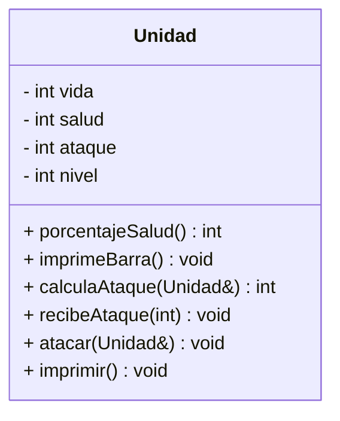

# Unidad de Combate

Clase que representa una unidad básica de combate para un juego de estrategia.

## UML

```mermaid
classDiagram

class Unidad{

- int vida
- int salud
- int ataque
- int nivel

+ porcentajeSalud() int
+ imprimeBarra() void
+ calculaAtaque(Unidad&) int
+ recibeAtaque(int) void
+ atacar(Unidad&) void
+ imprimir() void

}
```

